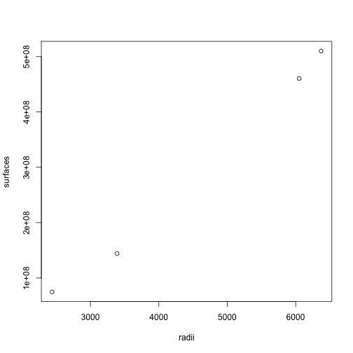

## Ist dieses Buch für Dich geeignet?

Du willst also R lernen? Dafür kann es viele Gründe geben, aber wahrscheinlich
willst Du in Zukunft R benutzen, um Daten zu analysieren und zu visualisieren.
Du bist also kein Grundschüler mehr, aber ob Du bereits Erfahrung mit
Programmiersprachen gesammelt hast oder nicht, kann ich nicht wissen.

Das Buch ist dazu gedacht, R zu lernen, aber nicht als genereller Einstieg in
die Programmierung. Wenn Du bereits Erfahrung mit anderen Sprachen gesammelt
hast, macht das die Dinge einfacher, weil Du die Denkmuster und die Ausdrücke
bereits kennst.

Ich versuche die Beispiele aber einfach genug zu halten, dass Du auch ohne
vorherige Programmiererfahrung dem Buch folgen kannst. Das setzt aber eine
aktivere Herangehensweise von Deiner Seite voraus.

Erstens solltest Du Begriffe, die Dir fremd sind nachschlagen, z.B. mittels
Wikipedia. Zweitens brauchst Du eine spielerische, aktive Herangehensweisea.
Du musst viel ausprobieren, auch wenn Dich das Buch nicht direkt dazu
auffordert, also aus eigenem Antrieb, bis Du fühlst, die Idee verstanden zu
haben. Drittens brauchst Du den Mut Kapitel, die du nicht sofort verstehst, zu
überspringen und das vor zu ziehen, was Dir zugänglicher erscheint.

Wenn diese aktive Herangehensweise nicht Deinem Naturel entspricht, empfehle
ich, die Grundlagen des Programmierens auf andere Weise zu lernen, insbesondere
in einem Kursus unter Anleitung. Solche Kurse als Einstieg in die
Programmierung findest Du wahrscheinlich leichter für andere Sprachen, wie
Python, Java oder JavaScript. Die modernen Programmiersprachen sind sich
ähnlicher als Du denkst.

## Einführung

### Hallo Welt in R


```r
print("Hallo Welt!")
```

```
## [1] "Hallo Welt!"
```

Bist Du enttäuscht? Nichts Neues im Vergleich zu anderen Sprachen?
R ist nicht schwer zu lernen. Das ist erst einmal gut so.

Charakteristisches für R zeigt dieses kleine Programm. Wir berechen die Umfänge
meherer Planeten anhand des Radius, ohne dass eine Schleife nötig wird.


```r
names <- c("Merkur", "Venus", "Erde", "Mars")
radii <- c(2440, 6052, 6371, 3389)
surfaces <- round(4 * pi * radii^2 / 1000) * 1000
paste(names, radii, "km", surfaces, "km^2")
```

```
## [1] "Merkur 2440 km 74815000 km^2" "Venus 6052 km 460265000 km^2"
## [3] "Erde 6371 km 510064000 km^2"  "Mars 3389 km 144329000 km^2"
```

Davon machen wir - quick and dirty - einen explorativen Plot, um zu sehen,
wie die Fläche im Quadrat ansteigt.


```r
plot(radii, surfaces)
```

 

Wie viel Zeilen Code wäre in anderen Sprachen nötig?

### Was ist R?

### Was macht R besonders?

Zwei der Besonderheiten von R hast Du gerade kennen gerlernt. Erstens die
unkomplizierte Weise, ganze Listen von Daten zu verarbeiten, zweitens die
komfortablen Möglichkeiten, Daten als Diagramme zu visualisieren.

R versucht dem möglichst nahe zu kommen, wie der Wissenschaftler denkt.
Einerseits sind das nicht unbedingt Schleifen, wie beim Programmierer.
Andererseits sind das zum Beispiel die Zuweisungsoperatoren "<-", wie sie
in der wissenschaftlichen Schreibweise gebräuchlich sind.

Wie bei anderen Sprachen auch, ist vieles gewachsen und begründet sich dann
als "historisch bedingt". Zur Geschichte gibt es noch ein eigenes Kapitel.

Das Alleinstellungsmerkmal von R sind aber sicherlich die umfangreichen
frei verfügbaren Bibliotheken, die dem Wissenschaftler zur Verfügung stehen,
um Daten aufzuarbeiten, zu analysiern und zu visualisieren.

Natürlich verabeiten alle Programmiersprachen Daten. Entscheidend ist also,
wie die Daten betrachtet und genutzt werden. In der Wissenschaft steht der
Erkenntnisgewinn im Vordergrund. Charakteristisch sind die Umformung der
Daten, die Analyse und die Visualisierung.

Vergleicht man das mit Twitter, steht dort der Transport und die Vervielfältigung
von Textnachrichten im Vordergrund, was zu anderen Anforderungen an die Software
führt. Vergleicht man das mit einem Betriebssystem, steht dort die Anbindung
der Hardware im Vordergrund, sowie die Aufteilung der Rechenzeit, was wiederum
ganz andere Anforderungen an die Software stellt.

Im Regelfall lädt R die Daten komplett in den Arbeitsspeicher, bevor es mit der
weiteren Verarbeitung beginnt. Für Twitter oder ein Betriebssystem wäre diese
Herangehensweise gar nicht möglich, weil die Daten kontinuierlich strömen.
Für die Verabeitung von Datenstömen ist R nicht optimiert.

### Ist R eine vollwertige Programmiersprache oder ein Werkzeug?

Die kurze Antwort ist, dass beides richtig ist. R ist durchaus eine
Programmiersprache, mit der man theoretisch alles programmieren kann.
Aber wie bereits angedeutet, ist jede Programmiersprache für bestimmte
Anwendungsbereiche optimiert.

Die Sprache alleine ist auch nicht das alles Entscheidende. Genauso wichtig
sind die verfügbaren Bibliotheken, Interpreter und Compiler, um das optimale
Einsatzgebiet einer Sprache zu bestimmen. R wird von Wissenschaftleren für
Wissenschaftler entwickelt und gepflegt. Das hat das Profil der vorhandenen
Werkzeuge geprägt.

Datenanalyse wird aber auch in weiten Bereichen der Wirtschaft, der Politik
oder des Journalismus immer wichtiger. Ensprechend weitet sich aus das Spektrum
der Bibliotheken aus. R ist heute geeignet, um datenzentierte Artikel und Bücher
zu verfassen. Dieses Buch ist mithilfe solcher Bibliotheken verfasst. Es
enstehen Bibliotheken, die die Veröffentlichung als Webseiten oder als mobile
Apps unterstützen, mit zunehmende interaktiven Möglichkeiten.

Die Entscheidung für die Sprache R wird also stark von den Bibliotheken
bestimmt, die für unterschiedliche Bereiche zur Verfügung stehen. Man kann R
als eine Sprache mit Bibilotheken betrachten. Das ist die Perspektive der
eingeschworenen Anhänger. Pragmatischere Nutzer sprechen eher von einem
Werkzeug, das über eine eigene Programmiersprache verfügt.

Ich finde, dass R im Vergleich zu andern Sprachen noch zu viele Grenzen
hat, um es uneigeschränkt als Programmiersprache für generelle Bereiche zu
empfeheln, wie zum Beispiel Java oder C++. Neben seinem Speicherhalten erreicht
es schnell Grenzen bei den Möglichkeiten der Objektorientieren Programmierung.
Geht es um Datenanalyse, ist es aber herausragend und baut seinen Versprung
eher noch aus.

R besetzte eine ähnliche Lücke, für die Perl ursprünglich konzeptioniert war,
als "Practical Extraction and Report Language". Perl hat diese Nische plötzlich
verlassen und wurde die erste Sprache der Internet Programmierung, um später
auf beiden Gebieten abgelöst zu werden, u.a wegen seiner Grenzen bei der
Objektorientieren Programmierung und der zu langsamen Erneuerung der Sprache.

Für komplexe Anwendungsbereich wird man R also im Verbund mit anderer Software
einsetzen. Dabei stellt sich im konkreten Fall die Frage, wo man die Daten
übergibt und in welcher Form.

